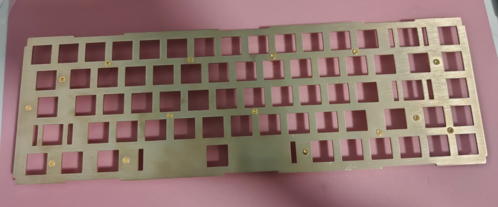
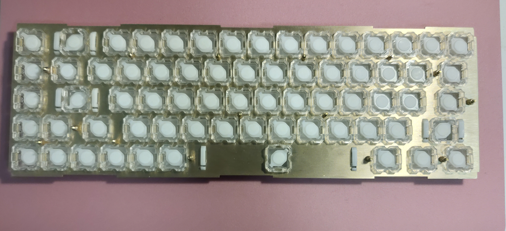
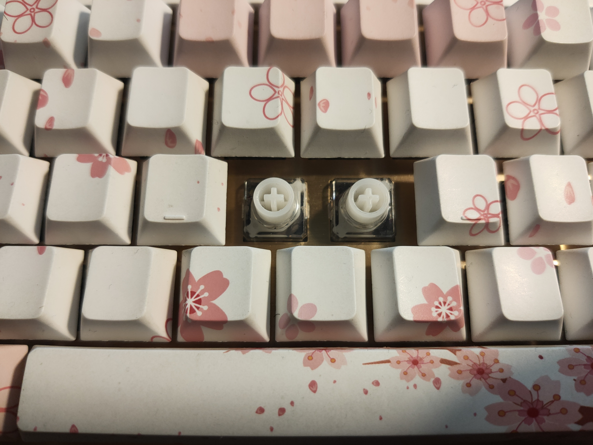
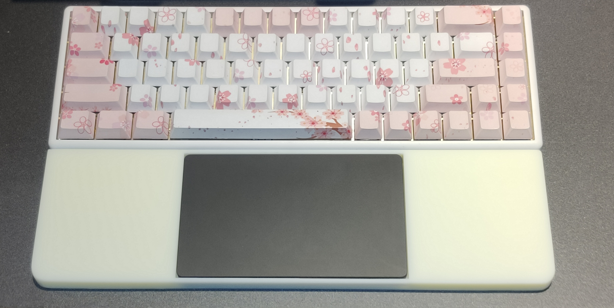

# niz68_material

### 改装niz68键盘的一些模型

1. 改装整体目标
    1. 替换硅胶碗为rf硅胶碗
    2. 替换原装定位板，其他零件均不变
    3. ~~设计新的定位板，使用rf的rgb轴体替换原装轴体~~
        - ~~rf的rgb轴边长似乎为14.3且顶部需有开槽, 定位板不与原装兼容~~
        - 计划无限期延后,原因是我润过轴换过定位板之后觉得手感比rf好
    4. 3d打印外壳

1. 改装进度
    - 硅胶碗已替换
    
        - 不太喜欢niz原厂静音圈的声音，去掉静音圈之后有了新的问题，推杆高度不够键帽有点晃
        - 原厂静音圈厚度0.8左右，去工厂定制了0.8厚度的硅胶带背胶垫片，已经贴在推杆下面
        
        
        - 目前手感基本等于hhkb非静音版,体感上推杆比rfrgb稳定
    - 非标螺柱已交付工厂打样
        - 螺柱没有问题, 可以正常使用
    - 定位板已成功替换,目前表现完美
    
    
    

    - 2021/1/15: 得知niz官方定位板上的方孔尺寸为14.1x14.1,故进一步更改图纸,更改前图纸的尺寸为14x14
    - 2021/1/17: 官方壳子逆向完成并做了一些更改

3. 文件夹及文件说明

dwg文件采用cad2021绘制, 不确定低版本兼容性

```
├── ./docs                              文档相关
├── ./LICENSE                           协议
├── ./plate                             定位板相关
│   ├── ./plate/非标螺柱.bak
│   ├── ./plate/非标螺柱.dwg             定位板上螺柱
│   ├── ./plate/niz68.bak
│   ├── ./plate/niz68.dwg               定位板
│   └── ./plate/plot.log
├── ./plate                             手托
├── ./shell                             外壳
└── ./README.md
```

4. 定位板设计

    - 标准定位板采用压铆螺柱链接做支撑，不方便小量设计
    - 图中直接采用非标螺柱进行支撑，使用m2沉头螺丝和m2螺母进行固定
    - 非标螺柱可3d打印, 不过最好使用cnc

5. 为了适配windows下触摸板, 3d打印了手托, 目前手感优秀没有误触

    - 3d打印文件见文件夹说明
    - 3d打印文件分减重版和实心版,减重版可以节省一些打印费用,后续可以通过预留的孔加入配重.~~还是别这么玩了,省不了多少钱还麻烦的一笔~~
    - 注意：**这里的触摸板不是mac的触摸板**, mac触摸板的尺寸不是这样的.~~这个触摸板为 brydge w-touch 这个广告没给我打钱, 所以划掉了~~