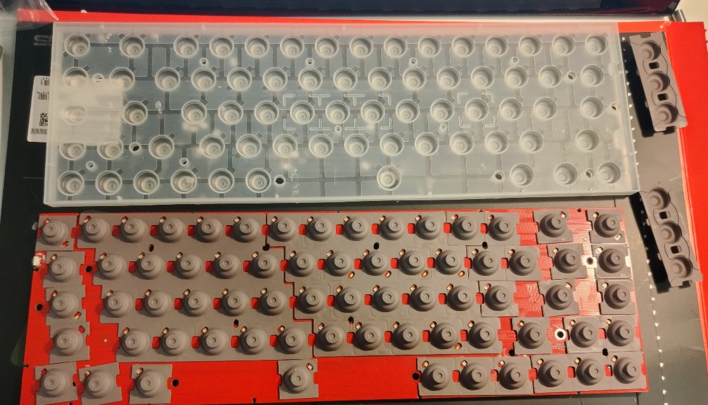
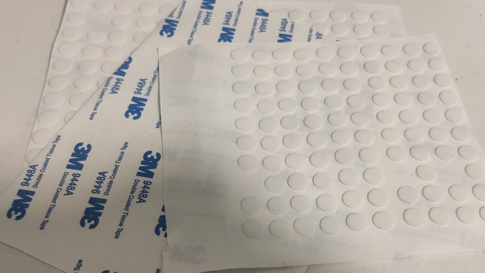
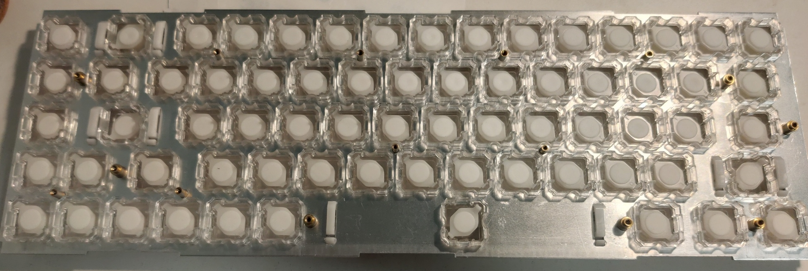

# niz68_material

### 改装niz68键盘的一些模型

1. 改装整体目标
    1. 替换硅胶碗为rf硅胶碗
    2. 替换原装定位板，其他零件均不变
    3. 设计新的定位板，使用rf的rgb轴体替换原装轴体
        - rf的rgb轴边长似乎为14.3且顶部需有开槽, 定位板不与原装兼容
    4. 3d打印外壳

1. 改装进度
    - 硅胶碗已替换
    
        - 不太喜欢niz原厂静音圈的声音，去掉静音圈之后有了新的问题，推杆高度不够键帽有点晃
        - 原厂静音圈厚度0.8左右，去工厂定制了0.8厚度的硅胶带背胶垫片，已经贴在推杆下面
        
        
        - 目前手感基本等于hhkb非静音版,体感上推杆比rfrgb稳定
    - 非标螺柱已交付工厂打样
    - 定位板在联系打样后期可能会完善孔位


1. 文件夹及文件说明

```
├── ./docs                              文档相关
├── ./LICENSE                           协议
├── ./plate                             定位板相关
│   ├── ./plate/非标螺柱.bak
│   ├── ./plate/非标螺柱.dwg           定位板上螺柱
│   ├── ./plate/niz68.bak
│   ├── ./plate/niz68.dwg              定位板
│   └── ./plate/plot.log
└── ./README.md
```

2. 定位板设计

    - 标准定位板采用压铆螺柱链接做支撑，不方便小量设计
    - 图中直接采用非标螺柱进行支撑，使用m2沉头螺丝和m2螺母进行固定
    - 非标螺柱可3d打印